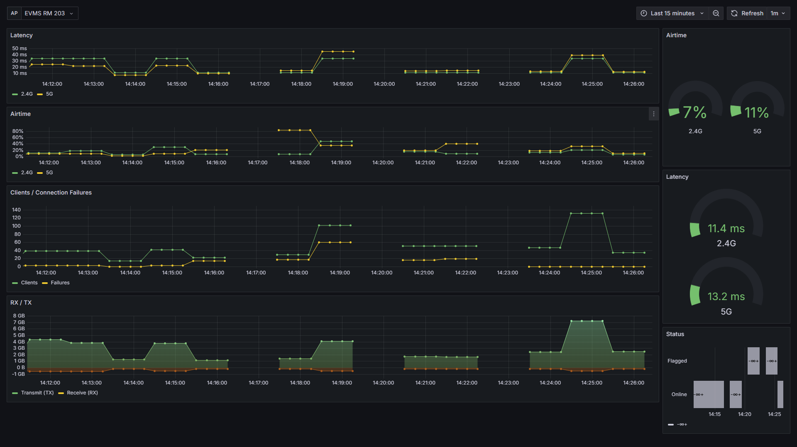
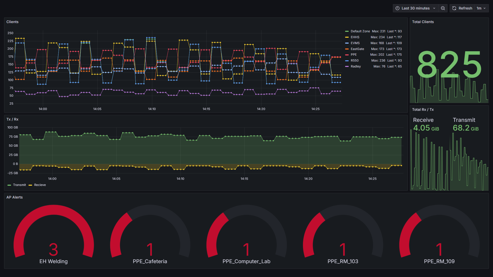
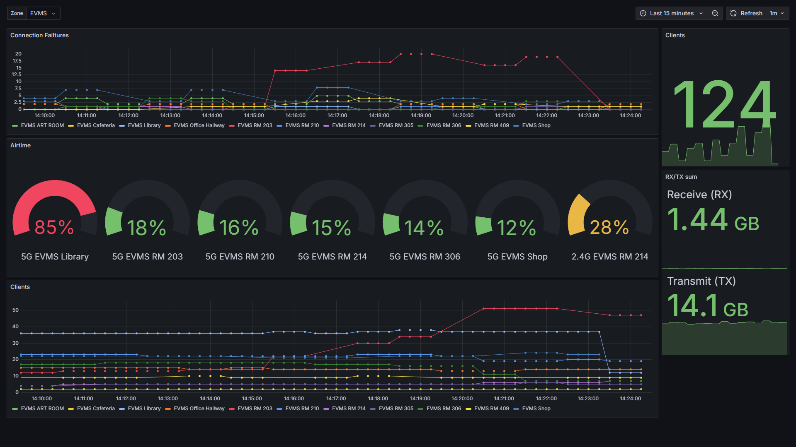

Scrapes api of a Ruckus Smartzone controller and then provides the data in an Opentelemtry spec.

Uses smartzone API v11.1

Provides 1 api endpoint:
```
/metrics
```

The program will be expecting 3 env vars:
```bash
RUST_URL='https://192.168.0.1:8448/' # The url of your smartzone controller
RUST_USERNAME='admin' # Smartzone username
RUST_PASSWORD='password1!' # Smartzone password
```

Also take a look at [the prometheus config](/vis/prometheus.yaml) to configure drop rules as it seems that smartzone can output the same AP twice, messing with your data.

The user that you create for using the API only needs read access to APs.



